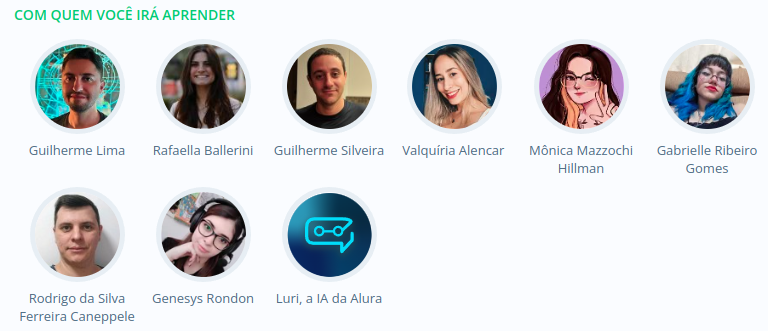
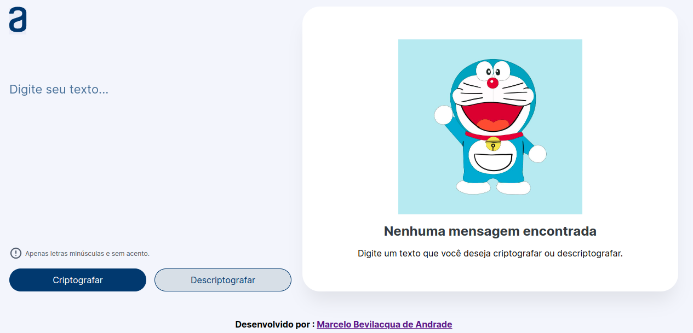
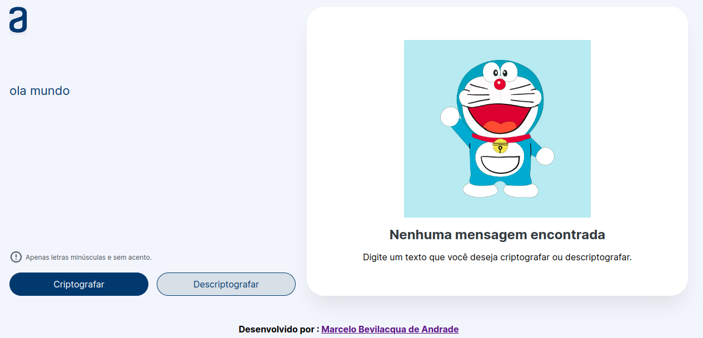
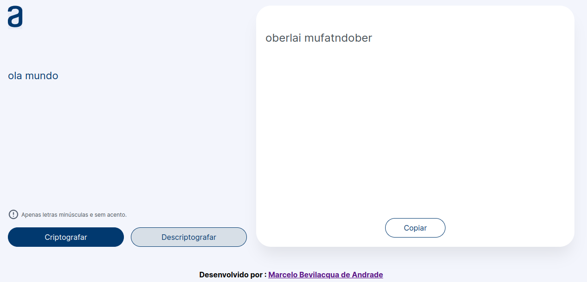
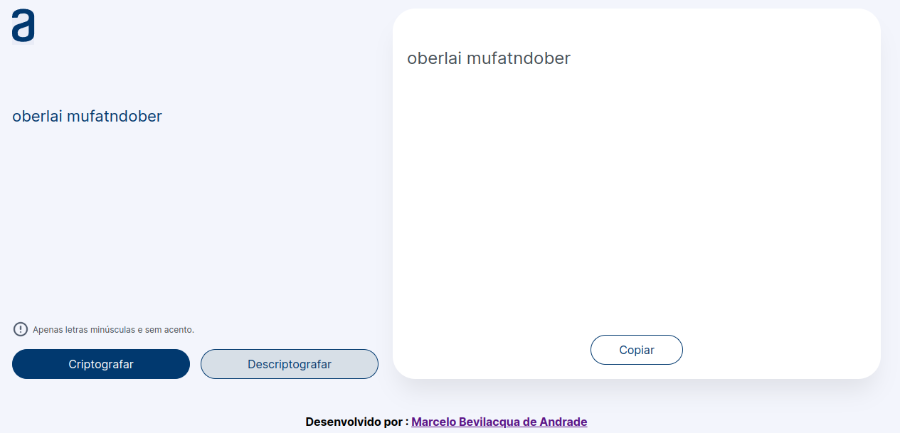

<h1> Projeto Challenge Decodificador Texto - Oracle ONE + Alura </h1>

 📜  Projeto Decodificador de texto </a> 📜 

 Sejam bem-vindos ao desafio:
 
 <strong>APRENDENDO NA PRÁTICA ATRAVÉS DO CURSO INICIANTE EM PROGRAMAÇÃO T7-ONE,DISPONIBILIZADO PELA PLATAFORMA ALURA EM PARCERIA COM A ORACLE .</strong>

 Desafio este que tive a honra de co-criar com a plataforma de cursos online <strong>

</strong> 💛 https://cursos.alura.com.br e https://www.oracle.com/br/education/oracle-next-education/ 🧡 e disponibilizado de forma gratuita para a comunidade. 

   
 💎 O objetivo principal é colocar em prática algumas das principais ferramentas para a construção de paginas web: <strong> HTML, CSS, JAVASCRIPT</strong> através de aulas dinamicas e intuitivas com exemplos práticos e exercicios.

<h3>🛑 Não sendo exigidos nenhum Pré-Requisitos para aprender essas tecnologias.</h3>

Através da inscrição para a seleção de candidatos no site   , fui selecionado e presenteado com uma bolsa para este curso oferecido entre uma parceria da Oracle Next Educadion e Alura, O ONE é um programa de educação e empregabilidade com objetivo social de capacitar pessoas em tecnologia e conectá-las com o mercado de trabalho por meio de empresas parceiras.

    

Ao longo de 30 dias e reservando pelo menos 4 horas por dia foi possível concluir a primeira etapa que foi dividida entre os cursos de 📚  HTML  📚 CSS 📚 JS ,  e assim aprender  <strong> Lógica de programação</strong>. 

E para esta jornada tivemos uma equipe de peso ministrando as aulas, que foram eles :  

    

Cada etapa foi concluida e assim foi possível compreender como são criadas paginas web ,e como são utilizadas as 🛠️ ferramentas de criação.

E para emglobar o curso foi ministrado o uso do Git e Github , ambos 👣 passo a passo 👣 para que fosse possível você chegar até aqui ao ler todo este conteúdo. 

   

<h1>🛑 O Desafio</h1>

   

<h2>Praticando Lógica de Programação:Challenge Decodificador de Texto</h2>

Ao final do curso de Logica de Programação foi disposto um desafio chamado de Challenge, e criar um Decodificador de Textos.O objetivo é criar uma aplicação que permita criptografar e descriptografar mensagens de texto.

<h3>🔺Tecnologias usadas 🎯</h3>

🔹 <strong>Html</strong> 
🔹 <strong>CSS</strong> 
🔹 <strong>Javascript</strong> 
🔹 <strong>Git</strong> 
🔹 <strong>Github</strong> 

 

<h3>🔺Funcionalidades</h3>

🔹 <strong>Criptografar: O usuário pode inserir um texto e clicar no botão "Criptografar" para transformar a mensagem em uma nova mensagem criptografada conforme regras exigidas no desafio.</strong> 

🔹 <strong>Descriptografar: O usuário pode inserir um texto criptografado e clicar no botão "Descriptografar" transformar a mensagem em uma nova mensagem Descriptografada conforme regras exigidas no desafio.</strong> 

🔹 <strong>Copiar: Após inserir um texto ou palavra usuário pode clicar no botão "Copiar", para copiar o texto criptografado ou descriptografado para a área de transferência.</strong> 

🔹 <strong>Uma das regras era não ser possível o uso de letras maiúsculas.</strong> 

<h3>🔺Como utilizar</h3>

✅ Acesse a pagina do projeto: 🔻Clique aqui: https://oracle-alura-challenge.vercel.app/ 🔻     
✅ Clique no campo onde está escrito "Digite seu texto..." e escreva o que deseja criptografar. 
✅ Clique no botão "Criptografar" para obter o resultado no campo ao lado. 
✅ Clique no botão "Copiar" para copiar o texto criptografado, e cole no campo "Digite seu texto..." caso queira descriptografar e clique no botão "Descriptografar" e veja o resultado.  

<h3>🔺Tutorial com Imagens</h3>

 <h1> 1°- </h1>

    

✅ <strong> No campo "Digite seu texto..." , escreva o que deseja criptografar.</strong>    
 

     

 
 <h1> 2°- </h1>

✅ <strong>Clique no botão "Criptografar" para obter o resultado no campo ao lado.</strong>   
 

     

 
 <h1> 3°- </h1>

 ✅ <strong>Clique no botão "Copiar" para copiar o texto criptografado, e cole no campo onde você havia digitado o texto.</strong>   

     

 
 <h1> 4°- </h1>

 ✅ <strong>Clique no botão "Descriptografar" e veja o resultado.</strong>  

     

    

<h3>🔺Descubra qual é a nossa mensagem secreta!</h3>

Ao final foi lançada uma mensagem criptografada como desafio de teste para observar se realmente esta funcionando a pagina, a mensagem foi a seguinte:

🔹 <strong>"pairaibenterns poberr enterncairair enterssenter dentersaifimesober enter tenterr fimesnailimeszaidober enterlenter coberm sufatcenterssober!"</strong> 

Caso desejar saber o que está escrito na mensagem, copie a mensagem criptografada,clique no link do projeto,cole no campo "Digite seu texto..." e clique no botão "Descriptografar". 

   

<h2 align="center"> ‼️ ESTE REPOSITÓRIO FOI CRIADO PARA O PROJETO CHALLENGE E PARA FINS DE ESTUDO. ‼️
 </h2>

    

 <h4>🛑 Fontes/Imagens</h4>
 ✅  https://cursos.alura.com.br  
 ✅  https://www.oracle.com/br/education/oracle-next-education/ 
 ✅  https://vercel.com  
 ✅  https://grupomonacodecultura.wordpress.com/2018/11/10/voce-conhece-o-gato-robotico-do-seculo-22-doraemon-%E3%83%89%E3%83%A9%E3%81%88%E3%82%82%E3%82%93-saiba-mais-sobre-esse-anime-classico-do-japao-de-1969/ 

 

